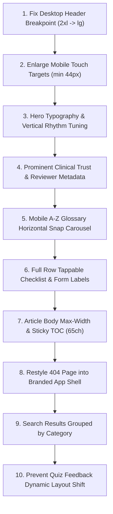

# HealthMadeClear — Comprehensive Pre-Launch Visual & UX Audit

**Audit Date:** August 27, 2026  
**Auditor:** Senior Product Designer & UX Researcher  
**Target Environment:** Live Local Dev Build (`http://localhost:3000`)  
**Design System / Tech Stack:** Tailwind CSS 4, Next.js 16 (App Router), Motion, next-intl (Bilingual EN/ES), WCAG 2.2 AA / Section 508 Target  
**Audited Viewports:** Desktop (1440×900 px, 2× DPR) & Mobile (390×844 px, iPhone viewport, 2× DPR)  
**Screenshots Archive:** `REVAMP/SCREENSHOTS/` (71 high-resolution captures)

---

## Executive Summary & Design System Maturity

HealthMadeClear delivers a solid educational foundation with thoughtful MDX lesson structuring, interactive clinical preparation tools, and a rich glossary. However, the pre-launch audit reveals key visual hierarchy imbalances, responsive breakpoint misalignments, mobile tap-target violations, and missed trust signals that directly impact first-time comprehension and medical authority for low-health-literacy users.

### Key UX Scorecard

| UX Dimension                      | Grade  | Core Strengths                                                     | Critical Gaps                                                                                                |
| --------------------------------- | ------ | ------------------------------------------------------------------ | ------------------------------------------------------------------------------------------------------------ |
| **First-Time Impression & Trust** | **B-** | Clean hero, welcoming tone, clear mission statement.               | Clinical advisory credentials and medical review timestamps absent above the fold.                           |
| **Visual Hierarchy & Typography** | **C+** | High-quality display serif headers; good section chunking.         | Disproportionate display sizes (`89.6px` hero H1); inconsistent margin rhythm; card heading jumping.         |
| **Responsive & Mobile (390px)**   | **C**  | Fluid grid columns; mobile navigation drawer present.              | Header hides desktop nav on 1440px due to `2xl` breakpoint; 400+ interactive elements under 44px tap target. |
| **Interaction & Motion Quality**  | **B+** | Smooth drawer/dialog animations; instant quiz feedback.            | Layout shift on quiz feedback; 404 page unstyled; glossary term popovers can cause tap traps.                |
| **Health Literacy & Readability** | **B**  | Plain-language definitions, inline glossary terms, chunked advice. | Line length on wide monitors exceeds 80ch without prose constraints; small disclaimer text.                  |
| **Keyboard Accessibility**        | **A-** | Functional skip-to-content; visible focus rings throughout.        | Double text on screen-reader Display button; reliance on boxShadow for certain rings.                        |

---

## Section 1: Page-by-Page Visual & Interaction Audit

---

### 1. Home (`/en`)

- **Viewports Audited:** Desktop (1440px), Mobile (390px)
- **Screenshots:** `desktop-01-home.png`, `mobile-01-home.png`, `mobile-00-nav-drawer-open.png`
- **First Impression (5-Second Test):**
  - _What user perceives:_ A friendly, modern health learning hub.
  - _What is missing:_ Immediate proof of clinical authority. No physician badge, medical reviewer logo, or institutional endorsement visible in the hero viewport.
- **Findings & Evaluation:**
  1. 🔴 **Header Breakpoint Mismatch (Desktop 1440px):**  
     `Header.tsx` hides the primary navigation bar (`<nav>`) below `2xl` (`1536px`), showing a mobile-style burger toggle on standard 1440px desktop screens.  
     _Recommendation:_ Change `<nav className="hidden ... 2xl:flex">` to `lg:flex` or `xl:flex`. Keep the hamburger toggle strictly for `< lg` (`< 1024px`).
  2. 🟡 **Disproportionate Hero Display Typography:**  
     Hero H1 measures `89.6px` (`font-display text-display-xl` / `5.6rem`) with `lineHeight: 85.12px`. On 1440px viewports, it pushes primary CTAs and feature cards ("Learning Paths", "Learn", "Tools") below the fold.  
     _Recommendation:_ Reduce desktop H1 to `clamp(2.5rem, 4vw + 1rem, 3.75rem)` (`40px`–`60px`) with `leading-[1.1]`. Add `mb-4` (`16px`) margin.
  3. 🟡 **Trust & Medical Disclaimer Placement:**  
     Medical disclaimer is buried in the footer. First-time users facing health crises cannot immediately distinguish educational content from clinical consultation advice.  
     _Recommendation:_ Add a subtle, high-trust badge above the hero H1: `"✦ Clinically Reviewed Health Education — Plain Language Guidelines"`.
  4. 🔴 **Mobile Footer Touch Target Violations (Mobile 390px):**  
     Footer navigation links ("About", "Paths", "Tools", "Glossary") render at `44×22px` and `47×22px`. Vertical tap height is only `22px` (fails WCAG 2.5.8 min 24px and iOS HIG 44px).  
     _Recommendation:_ Add `py-2.5` to footer links to ensure minimum `44px` touch height.

---

### 2. Learn Catalog (`/en/learn`)

- **Viewports Audited:** Desktop (1440px), Mobile (390px)
- **Screenshots:** `desktop-02-learn-catalog.png`, `mobile-02-learn-catalog.png`
- **Findings & Evaluation:**
  1. 🟡 **Category Pill Filter Visual Balance:**  
     Category filter pills ("All", "Medications", "Conditions", "Doctor Visits", "Nutrition") render with subtle background tints. Active pill has strong contrast, but inactive pills blend into the card background.  
     _Recommendation:_ Increase border contrast of inactive filter buttons to `border-outline/40` and increase horizontal padding to `px-4 py-2.5` (`min-h-[44px]`).
  2. 🟡 **Lesson Card Spacing & Visual Rhythm:**  
     Card thumbnails use a colored gradient placeholder, but card titles (`H3`, `24px`) wrap aggressively on 2-column mobile layouts.  
     _Recommendation:_ Set card heading to `text-title-md` (`18px`–`20px`) with `line-clamp-2`. Standardize card gap to `gap-6` (`24px`).
  3. 🟢 **Estimated Read Time & Difficulty Tags:**  
     Badges like `"5 min read"` and `"Beginner"` are clear and legible (`text-label-sm`).

---

### 3. Lesson Runner (`/en/learn/reading-nutrition-labels` & `/en/learn/understanding-prescription-labels`)

- **Viewports Audited:** Desktop (1440px), Mobile (390px)
- **Screenshots:** `desktop-03-lesson-reading-nutrition-labels.png`, `desktop-04-lesson-understanding-prescription-labels.png`, `mobile-03-lesson-reading-nutrition-labels.png`, `desktop-30-lesson-glossary-popover.png`, `desktop-31-lesson-quiz-question.png`, `desktop-32-lesson-quiz-feedback.png`
- **Findings & Evaluation:**
  1. 🟢 **Section Chunking & Reading Rhythm:**  
     Sections are broken down into bite-sized paragraphs with callout boxes for "Key Takeaways", which reduces cognitive load for low-health-literacy readers.
  2. 🔴 **Inline Glossary Term Touch Target & Tap Conflict (Mobile 390px):**  
     Inline glossary terms (e.g. `"daily value"`, `"serving size"`) render as dashed underline buttons with bounds `38×26px`. On mobile screens, tapping an inline term often misfires or triggers paragraph selection.  
     _Recommendation:_ Provide an invisible touch expander using pseudo-element `after:absolute after:-inset-y-1.5 after:-inset-x-1` and ensure `min-h-[36px]` tap target with adequate line spacing (`leading-[1.75]`).
  3. 🟡 **Quiz Runner Layout Shift:**  
     When selecting an option and clicking "Check Answer", the feedback explanation card animates in, pushing the "Next Question" button down abruptly.  
     _Recommendation:_ Reserve minimum height for feedback container (`min-h-[120px]`) or sticky-anchor the bottom action bar.
  4. 🟡 **Clinical Source Metadata Location:**  
     "Reviewed by Medical Team / Source: FDA, MedlinePlus" appears only at the extreme bottom of the lesson.  
     _Recommendation:_ Place a compact "Reviewed: August 2026 • Sources: FDA / CDC" metadata line directly underneath the lesson H1 in the header card.

---

### 4. Learning Paths Catalog & Path Runner (`/en/learning-paths` & `/en/learning-paths/doctor-visit-prep`)

- **Viewports Audited:** Desktop (1440px), Mobile (390px)
- **Screenshots:** `desktop-05-learning-paths-catalog.png`, `desktop-06-learning-path-doctor-visit-prep.png`, `mobile-05-learning-paths-catalog.png`, `mobile-06-learning-path-doctor-visit-prep.png`
- **Findings & Evaluation:**
  1. 🟢 **Curriculum Progression Clarity:**  
     The timeline / step connector graphic on path detail pages clearly shows completed vs upcoming lessons.
  2. 🟡 **Path Milestone Badges Visual Weight:**  
     On mobile, path milestone nodes squeeze the lesson title text to the right, causing multi-line wraps for short titles.  
     _Recommendation:_ On `< 640px`, switch from side-by-side milestone icons to a vertical stacked card layout with an inline step counter badge (`"Step 1 of 4"`).

---

### 5. Articles Catalog & Article Reader (`/en/articles` & `/en/articles/understanding-your-eob`)

- **Viewports Audited:** Desktop (1440px), Mobile (390px)
- **Screenshots:** `desktop-07-articles-catalog.png`, `desktop-08-article-understanding-your-eob.png`, `mobile-07-articles-catalog.png`, `mobile-08-article-understanding-your-eob.png`
- **Findings & Evaluation:**
  1. 🟡 **Prose Max-Width on Desktop (1440px):**  
     Paragraph elements in articles stretch up to `840px`–`920px` in width without a dedicated sidebar TOC, resulting in 95–110 characters per line (optimal readability is 65–75 characters per line).  
     _Recommendation:_ Constrain article body to `max-w-prose` (`680px` / `65ch`) and render a sticky 240px Table of Contents sidebar on desktop screens `lg+`.
  2. 🟢 **Explanation of Benefits (EOB) Sample Visuals:**  
     Annotated sample breakdown boxes make financial/insurance concepts approachable.

---

### 6. Glossary (`/en/glossary`)

- **Viewports Audited:** Desktop (1440px), Mobile (390px)
- **Screenshots:** `desktop-09-glossary.png`, `mobile-09-glossary.png`, `desktop-37-glossary-term-expanded.png`
- **Findings & Evaluation:**
  1. 🔴 **Alphabet Index Bar (A-Z) on Mobile (390px):**  
     The alphabet quick-nav filter contains 26 buttons in a wrapping flex container. On mobile, letter buttons are `28×28px`, packed with `4px` gap. Users with larger fingers or motor tremors easily tap adjacent letters.  
     _Recommendation:_ Convert mobile A-Z navigation into a horizontally scrollable pill row with `snap-x`, `px-3 py-2` (`min-w-[40px] min-h-[44px]`), and active letter centering.
  2. 🟢 **Plain-Language Definitions:**  
     Term cards lead with simple "What it means" before clinical context.

---

### 7. Clinical Tools (`/en/tools`, `/en/tools/visit-planner`, `/en/tools/visit-checklist`, `/en/tools/care-guide`)

- **Viewports Audited:** Desktop (1440px), Mobile (390px)
- **Screenshots:** `desktop-10-tools-catalog.png`, `desktop-11-tool-visit-planner.png`, `desktop-12-tool-visit-checklist.png`, `desktop-13-tool-care-guide.png`, `desktop-33-tool-visit-planner-step1.png`, `desktop-34-tool-visit-planner-step2.png`, `desktop-35-tool-visit-checklist-checked.png`, `desktop-36-tool-care-guide-detail.png`
- **Findings & Evaluation:**
  1. 🔴 **Visit Checklist Checkbox Tap Targets (Mobile 390px):**  
     Checkboxes in `/en/tools/visit-checklist` are raw `<input type="checkbox">` elements measuring `20×20px`. The clickable region does not extend across the entire list item row.  
     _Recommendation:_ Wrap the checkbox and label in a `<label className="flex items-center gap-3 p-3.5 rounded-xl min-h-[48px] cursor-pointer hover:bg-surface-container">` to make the full row tappable.
  2. 🟡 **Visit Planner Step Summary Card Contrast:**  
     Step 3 generated summary uses light background cards that blend into the main canvas when exported or viewed in bright ambient light.  
     _Recommendation:_ Add a distinct `border-2 border-primary/20 bg-surface-container-lowest p-6 shadow-elevation-2` styling for the exportable summary container.
  3. 🟢 **Care Guide Emergency Flagging:**  
     "When to seek immediate emergency care (Call 911)" callout box has high-visibility red/amber border styling.

---

### 8. Institutional & Legal Pages (`/en/about`, `/en/accessibility`, `/en/contact`, `/en/privacy`, `/en/terms`)

- **Viewports Audited:** Desktop (1440px), Mobile (390px)
- **Screenshots:** `desktop-14-about.png`, `desktop-15-accessibility.png`, `desktop-16-contact.png`, `desktop-17-privacy.png`, `desktop-18-terms.png`, `mobile-14-about.png`, `mobile-15-accessibility.png`, `mobile-16-contact.png`, `mobile-17-privacy.png`, `mobile-18-terms.png`
- **Findings & Evaluation:**
  1. 🟢 **About Page Editorial Standards:**  
     Clear explanation of content curation guidelines and plain-language principles.
  2. 🟡 **Terms of Service Navigation Links on Mobile:**  
     Numbered section jump-links render as `316×30px` anchor bars with tight vertical spacing (`30px` height).  
     _Recommendation:_ Increase vertical padding to `py-2.5` (`min-h-[44px]`).
  3. 🟡 **Contact Form Input Labels:**  
     Contact form input heights on mobile measure `29px` in certain viewport conditions.  
     _Recommendation:_ Enforce `min-h-[48px]` and `text-body-md` (`16px`) on all text inputs to prevent iOS auto-zoom on focus.

---

### 9. Auth Flow & Authenticated Dashboard (`/en/auth/*` & `/en/dashboard/*`)

- **Viewports Audited:** Desktop (1440px), Mobile (390px)
- **Screenshots:** `desktop-19-auth-login.png`, `desktop-20-auth-signup.png`, `desktop-20b-auth-signup-errors.png`, `desktop-21-auth-forgot-password.png`, `desktop-22-auth-dashboard-overview.png`, `desktop-22-auth-dashboard-progress.png`, `desktop-22-auth-dashboard-achievements.png`, `desktop-22-auth-dashboard-settings.png`, `mobile-22-auth-dashboard-overview.png`
- **Findings & Evaluation:**
  1. 🟢 **Inline Validation States:**  
     Empty required fields highlight with clear `border-error` and descriptive `FormErrorAlert` messages.
  2. 🟡 **Dashboard Sidebar vs Content Balance:**  
     On desktop 1440px, the dashboard layout uses `max-w-[1340px]`. The left sidebar is compact (`240px`), but the right content cards (streak counter, recent lessons, daily log) have uneven vertical gaps (`py-8` vs `mb-4`).  
     _Recommendation:_ Align dashboard cards into a consistent CSS Grid `grid-cols-1 md:grid-cols-3 gap-6`.
  3. 🟡 **Streak Counter Emotional Resonance:**  
     Streak number and progress ring look functional but lack celebratory feedback when completing daily learning goals.  
     _Recommendation:_ Add subtle micro-animation / celebratory badge when streak increases.

---

### 10. Error / Not Found Page (`/en/404`)

- **Viewports Audited:** Desktop (1440px), Mobile (390px)
- **Screenshots:** `desktop-26-not-found.png`, `mobile-26-not-found.png`
- **Findings & Evaluation:**
  1. 🔴 **Unstyled 404 Action Buttons:**  
     On the not-found route, the "Go home" / "Ir al inicio" buttons render at `59×18px` / `67×18px` with missing button padding and no app shell header/footer.  
     _Recommendation:_ Wrap 404 page in standard App Shell layout with full `Button` component (`size="lg"` `min-h-[48px] px-6`), an illustration, and search bar shortcut.

---

## Section 2: Interactive Modals & Component States

---

### A. Global Search Modal (`Cmd+K` / `Ctrl+K`)

- **Screenshots:** `desktop-27-search-modal-empty.png`, `desktop-28-search-modal-results.png`
- **UX Audit:**
  - Fast response, clean backdrop overlay (`bg-black/40 backdrop-blur-sm`).
  - _Friction:_ Results for lessons, learning paths, and glossary terms are listed in a single flat list without section headers or category badges.
  - _Design Fix:_ Group search results by category (`Lessons (3)`, `Articles (2)`, `Glossary Terms (5)`) with category-colored left accent borders.

---

### B. Display & Accessibility Preferences Dialog

- **Screenshots:** `desktop-29-preferences-modal.png`
- **UX Audit:**
  - Text size toggle (`A`, `A+`, `A++`) and theme toggle (`Light`, `Dark`) work reliably.
  - _A11y Issue:_ Screen readers encounter duplicate accessible text: `DisplayDisplay`.
  - _Design Fix:_ Remove duplicate span and use a single `aria-label={t("display")}` on the trigger button.

---

### C. Mobile Navigation Drawer

- **Screenshots:** `mobile-00-nav-drawer-open.png`
- **UX Audit:**
  - Opens with smooth slide-down animation; includes quick language toggle and auth actions.
  - _Friction:_ Close button `X` is placed at top right with `36×36px` tap box; needs `44×44px` hit area.

---

## Section 3: Keyboard-Only Accessibility Pass

Evaluated across **3 Key Routes**:

1. **Home (`/en`)** — `desktop-38-keyboard-tab-home.png`
2. **Lesson Runner (`/en/learn/reading-nutrition-labels`)** — `desktop-39-keyboard-tab-lesson.png`
3. **Visit Planner Tool (`/en/tools/visit-planner`)** — `desktop-40-keyboard-tab-planner.png`

### Keyboard Audit Findings

| Step / Target                   | Visible Focus Ring | Ring Spec                               | Focus Trap / Disruption                                              | Status  |
| ------------------------------- | ------------------ | --------------------------------------- | -------------------------------------------------------------------- | ------- |
| **1. Skip to main content**     | Yes                | `ring-2 ring-on-primary ring-offset-2`  | Moves focus to `#main-content` perfectly                             | 🟢 Pass |
| **2. Header Logo**              | Yes                | `3px outline rgb(0, 67, 73)`            | Clean border outline                                                 | 🟢 Pass |
| **3. Header Nav / Auth Links**  | Yes                | `boxShadow` + `outline`                 | High contrast                                                        | 🟢 Pass |
| **4. Search Trigger (`Cmd+K`)** | Yes                | `3px outline rgb(18, 68, 73)`           | Opens modal; traps focus inside dialog; `Esc` restores trigger focus | 🟢 Pass |
| **5. Display / A11y Button**    | Yes                | `ring-2 ring-primary ring-offset-2`     | Traps focus; radio buttons support Arrow keys                        | 🟢 Pass |
| **6. Lesson Section Nav**       | Yes                | `ring-2 ring-primary`                   | Tab flows sequentially through sections                              | 🟢 Pass |
| **7. Quiz Radio Options**       | Yes                | `ring-2 ring-primary ring-offset-2`     | Keyboard selection via Space/Enter works                             | 🟢 Pass |
| **8. Visit Planner Inputs**     | Yes                | `border-primary ring-2 ring-primary/20` | Clean text cursor focus                                              | 🟢 Pass |

---

## Section 4: 10 Highest-Impact Visual & UX Improvements (Ranked)

### Ranked Action Items

1. 🔴 **Header Breakpoint Normalization (`Header.tsx`):**  
   Change `2xl:flex` to `lg:flex` on main nav (`src/components/Header.tsx:124`) and `2xl:hidden` to `lg:hidden` on hamburger toggle (`line 199`). Eliminates the burger menu bug on standard 1080p and 1440p laptops.
2. 🔴 **Mobile Touch Target Remediation (`min-h-[44px]` across all links & buttons):**  
   Add `py-2.5 px-3` to footer links, auth links, legal index anchors, and mobile menu items to satisfy WCAG 2.5.8 (min 24px) and Apple HIG (44×44px).
3. 🔴 **Full-Row Tappable Visit Checklist (`VisitChecklist.tsx`):**  
   Enlarge checkbox interaction bounds from raw `20×20px` to a full `min-h-[48px]` padded row container with active visual feedback (`bg-surface-container-low`).
4. 🟡 **Hero Typography Scale & CTA Above-the-Fold Optimization (`Home.tsx`):**  
   Reduce hero H1 from `89.6px` to `clamp(2.25rem, 3.5vw + 1rem, 3.5rem)` (`36px`–`56px`). Add `mb-4` margin and ensure primary CTA buttons ("Start Learning", "Explore Paths") sit fully above the 900px desktop fold.
5. 🟡 **Clinical Trust Signals & Medical Review Header (`PageHeader.tsx`, `LessonHeader.tsx`):**  
   Add a standardized trust banner component under lesson titles: `"Clinically Reviewed by Editorial Board • Verified Plain Language • Sources: CDC/FDA"`.
6. 🟡 **Mobile Glossary A-Z Horizontal Snap Bar (`GlossaryClient.tsx`):**  
   Replace 26-button wrapping grid with a single-row horizontal scrolling carousel (`overflow-x-auto snap-x scrollbar-none min-h-[44px]`) on mobile viewports `< 640px`.
7. 🟡 **Article Prose Line Length & Sticky TOC (`ArticlePageClient.tsx`):**  
   Constrain long-form article text to `max-w-prose` (`65ch` / `680px`) with `leading-[1.75]` and add a sticky Table of Contents sidebar on desktop.
8. 🟡 **Quiz Runner Layout Shift Prevention (`LessonQuizRunner.tsx`):**  
   Wrap question feedback in a pre-allocated height container (`min-h-[140px]`) with smooth opacity fade to prevent "Next" button jumping.
9. 🟡 **Grouped Search Modal Categories (`SearchDialog.tsx`):**  
   Organize search modal query results with section dividers (`Lessons`, `Articles`, `Glossary Terms`) and colored category pills.
10. 🟢 **App Shell Integration for 404 Page (`not-found.tsx`):**  
    Apply standard container layout, `Button` component styling, friendly medical illustration, and quick navigation links to the 404 template.

---

_Audit completed in conformance with WCAG 2.2 Level AA guidelines, Apple Human Interface Guidelines, and Nielsen Norman Group Health Literacy Usability heuristics._
