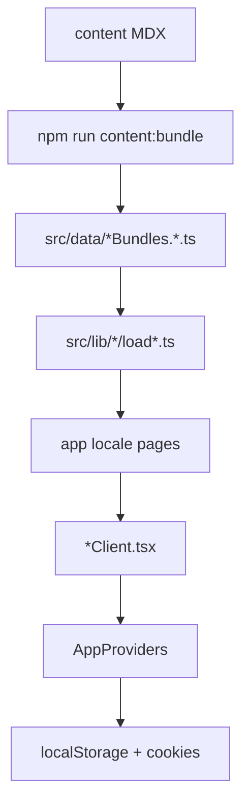

# Architecture

## Overview

Health Made Clear is a Next.js 14 App Router site with static generation, bilingual routing (`next-intl`), and client-side progress stored in `localStorage`.

## Internationalization

- **Routing:** `src/middleware.ts`, `src/i18n/routing.ts`
- **UI strings:** `src/messages/{en,es}.json` via `next-intl` `useTranslations` in client components
- **Content:** locale-specific MDX bundles

## State

`AppProviders` holds theme, text size, simple mode, locale, and learning progress. Preference cookies sync display settings before React hydrates (`PREFERENCE_BOOTSTRAP_SCRIPT`).

## Security

- No server database or auth
- Security headers in `next.config.js`
- Optional Sentry via `NEXT_PUBLIC_SENTRY_DSN`

## Testing

- Unit: Vitest (`src/lib`, hooks, `AppProviders`)
- E2E: Playwright (`e2e/`)
